# Creating LTI compatible Tool

In this section, we will walk through the implementation of an LTI tool by creating an example.

For this tutorial, we will use Moodle LMS to test our LTI tool, as it has up and running sandbox that anyone can use: [Moodle Sandbox](https://sandbox.moodledemo.net/).

We will use the Nuxt framework for the tool because it provides a unified process for both client and server, making setup and deployment simpler. Note that our Nuxt applications use in-memory storage for essential data, which resets with every change to the server files.

The code for this example can be found in this repository: [GitHub - LTI Tool example](https://github.com/ikovac/lti-tool-example).

Let's start with the tool installation.

First, we need to set up the tool application. To make our application accessible from the outside without deploying it, we will use an SSH tunnel. Visual Studio Code simplifies this process. Open the VSCode terminal, select the `PORTS` tab, and click on the `Forward a Port` button.

Enter `3000` as the port number. By default, the port visibility is set to `Private`, so we need to change it to `Public`.

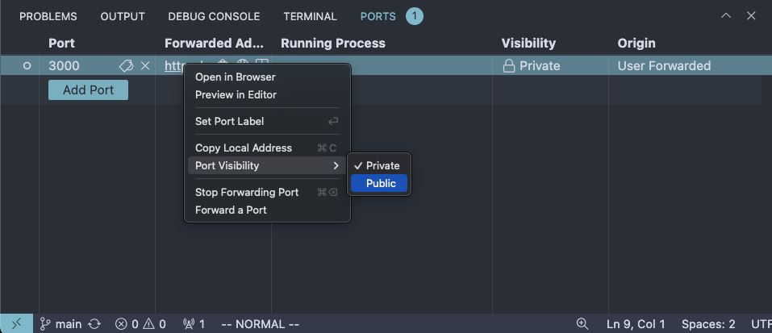

Right-click on the created row and change the Port Visibility to Public.

Now, copy the provided address to the `NUXT_SERVER_URL` environment variable inside the `.env` file and run the following commands:

1. `pnpm i`
2. `pnpm build`
3. `pnpm preview`

The application should now be up and running on port `3000`.

Navigate to the [Moodle Sandbox](https://sandbox.moodledemo.net/) and log in as an admin user. Go to the tool configuration page as shown in the image below.

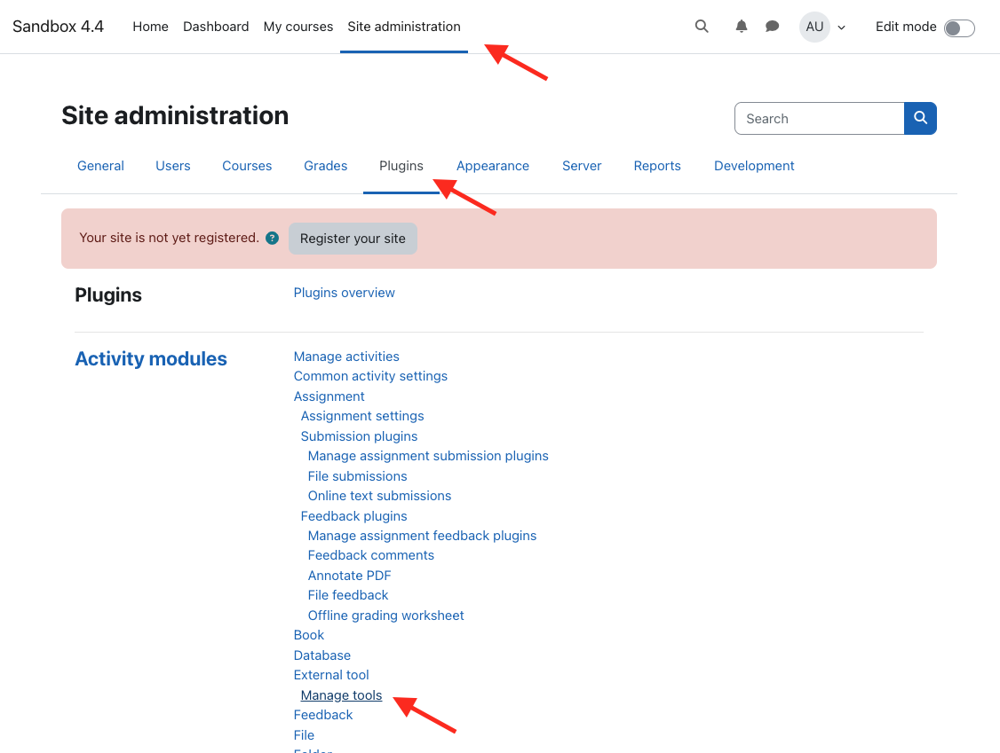

Go to the tool configuration page by navigating to Site administration → Plugins → Manage tools.

Enter the tool registration URL, which is `{NUXT_SERVER_URL}/registration`, and click the "Add LTI Advantage" button.

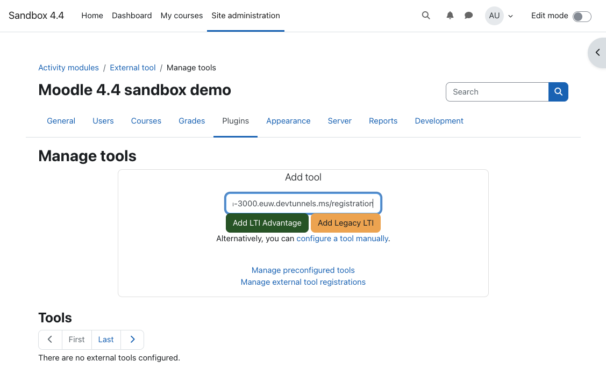

We’ve just performed dynamic registration. Alternatively, we could register the tool manually by filling in all the required fields and then adding the generated platform data to the tool's internal store. However, with dynamic registration, all of this is done automatically behind the scenes.

## Dynamic registration flow

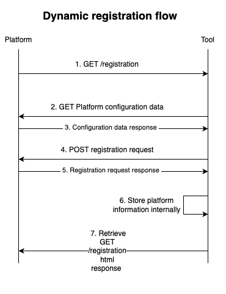

Dynamic registration flow

1. The Moodle Platform sends a `GET` request to the registration URL that we entered when registering the tool. This request contains the `openid_configuration` and `registration_token` query parameters:
   - `openid_configuration`: The endpoint for the OpenID configuration to be used for this registration.
   - `registration_token` (optional): The registration access token. If present, it must be used as the access token by the tool when making the registration request to the registration endpoint exposed in the OpenID configuration.
2. When the `GET` request is received, the tool performs a `GET` request to the `openid_configuration` endpoint (in this example, [https://sandbox.moodledemo.net/mod/lti/openid-configuration.php](https://sandbox.moodledemo.net/mod/lti/openid-configuration.php)) to obtain the necessary platform OpenID configuration data.
3. The platform responds with the configuration data.
4. The tool sends a `POST` registration request with the following body:

```tsx
const registrationRequest = {
  application_type: "web",
  grant_types: ["implicit", "client_credentials"],
  response_types: ["id_token"],
  redirect_uris: [launchUrl.href, deepLinkUrl.href],
  initiate_login_uri: loginUrl.href,
  client_name: "Nuxt LTI Tool",
  jwks_uri: keysUrl.href,
  logo_uri: "https://nuxtjs.ir/logos/nuxt-icon-white.png",
  token_endpoint_auth_method: "private_key_jwt",
  scope: scope.join(" "),
  "https://purl.imsglobal.org/spec/lti-tool-configuration": {
    domain: serverUrl,
    description: "Example Nuxt LTI Tool for testing purposes",
    target_link_uri: launchUrl.href,
    custom_parameters: {},
    claims: configuration.claims_supported,
    messages: [
      { type: "LtiResourceLinkRequest" },
      {
        type: "LtiDeepLinkingRequest",
        target_link_uri: deepLinkUrl.href,
      },
    ],
  },
};
```

Some properties are hardcoded and defined by the specification, while others are configured specifically for this tool. I will refer to this configuration later when explaining other LTI flows. All available options can be found in the LTI dynamic registration specification: [LTI Dynamic Registration Specification](https://www.imsglobal.org/spec/lti-dr/v1p0#openid-configuration).

It is important to set the `Authorization` header for this request if the `registration_token` is present in order to get a successful response.

```tsx
$fetch(configuration.registration_endpoint, {
  method: "POST",
  body: registrationRequest,
  headers: {
    Authorization: `Bearer ${registrationToken}`,
  },
});
```

5. The platform responds with a registration response that looks something like this:

```tsx
const registrationResponse = {
  client_id: "wHTqucAq5B2slOC",
  response_types: ["id_token"],
  jwks_uri: "https://my-example-tool.com/keys",
  initiate_login_uri: "https://my-example-tool.com/login",
  grant_types: ["client_credentials", "implicit"],
  redirect_uris: ["https://my-example-tool.com"],
  application_type: "web",
  token_endpoint_auth_method: "private_key_jwt",
  client_name: "Nuxt LTI Tool",
  logo_uri: "https://nuxtjs.ir/logos/nuxt-icon-white.png",
  scope:
    "https://purl.imsglobal.org/spec/lti-ags/scope/score https://purl.imsglobal.org/spec/lti-ags/scope/result.readonly https://purl.imsglobal.org/spec/lti-ags/scope/lineitem.readonly https://purl.imsglobal.org/spec/lti-ags/scope/lineitem https://purl.imsglobal.org/spec/lti-nrps/scope/contextmembership.readonly",
  "https://purl.imsglobal.org/spec/lti-tool-configuration": {
    version: "1.3.0",
    deployment_id: "1",
    target_link_uri: "https://my-example-tool.com",
    domain: "my-example-tool.com",
    description: "Example Nuxt LTI Tool for testing purposes",
    claims: ["sub", "iss", "name", "family_name", "given_name", "email"],
  },
};
```

6. After receiving the registration response, the tool first generates a new platform key pair and then stores the platform data in its internal storage.
7. Finally, the tool sends an HTML response to signal to the platform that the registration process is complete. Since the registration is performed inside an iframe, the tool responds with a script containing a `postMessage` call to send a message to the platform.

```html
<script>
  (window.opener || window.parent).postMessage(
    { subject: "org.imsglobal.lti.close" },
    "*"
  );
</script>
```

Now, the Nuxt LTI Tool should appear in the Tools section. Click the “Activate” button to activate your tool so it can be used within courses.

## Adding Tool to the course

After registering and activating the tool, navigate to the “My courses” page, enable “Edit mode” and click on “Create new course”.

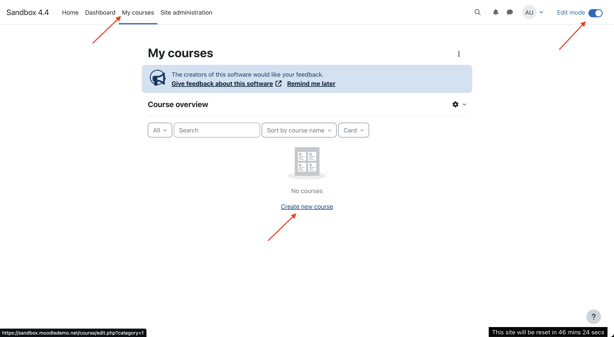

On the "Add a new course” page enter course name (ex. first course) and short name (ex. test1) and click on “Save and display” button.

Before adding, the tool to the course, let’s first enrol test student to the course by going to the “Participants” tab and clicking “Enrol users” button.

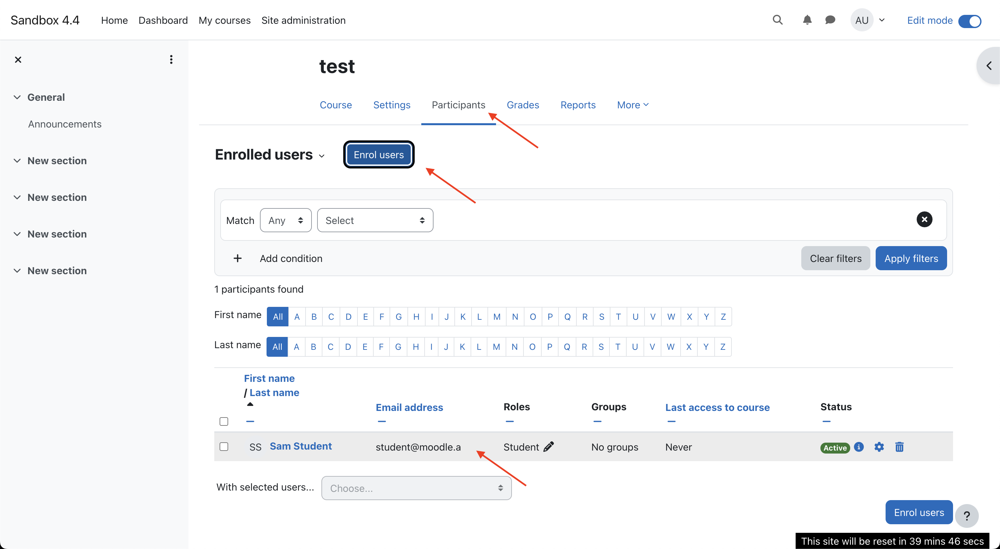

Select “Sam Student student@moodle.a” and click “Enrol users” button.

After that, click on “More” tab and select “LTI External tools” and enable our Nuxt LTI tool.

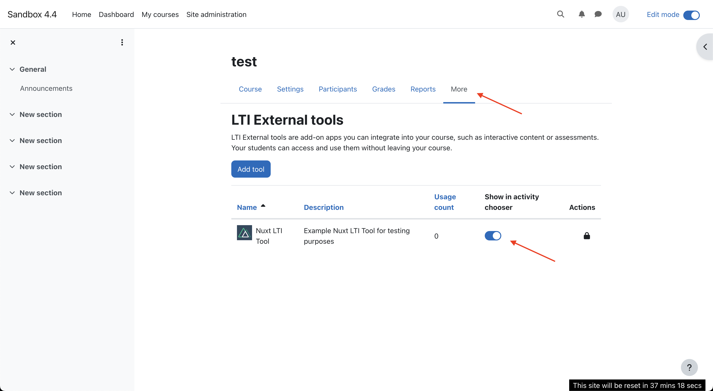

Once we are done with that, we can navigate to the “Course” tab and click on “Add an activity or resource” button to add our tool to the course section.

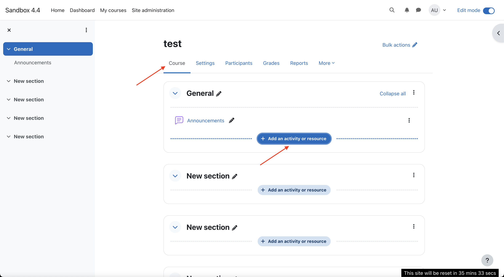

When modal appears, select “Nuxt LTI Tool”.

You should be presented with page like shown on the image below.


### Deep linking

As already described in the [LTI - Theory page](https://www.notion.so/LTI-Theory-53b4ccb26b0b417f9d6b0f498dffcdea?pvs=21), Deep Linking enables a platform to seamlessly integrate content from an external tool. Platform users can navigate to a URI provided by an external tool, select specific content suited to their needs, and receive a URI that other platform users can later use to directly access the selected content.

For instance, using the deep linking message, course designers can access a publisher's tool, choose relevant course content modules, and obtain LTI resource links. When students use these links, they will be taken directly to the chosen content modules instead of a general "table of contents" page.

To initiate the deep linking flow, click the "Select Content" button. This will open the tool’s `deep-link-select` page, where you can select the resource for which the LTI link will be saved for future tool launches.

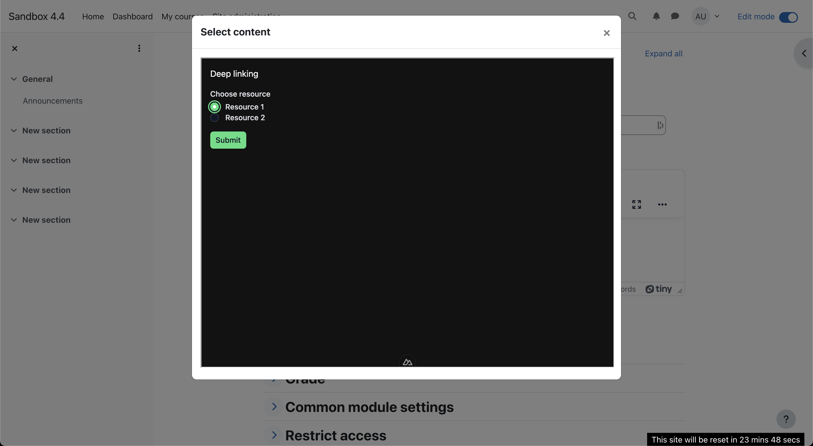

After clicking the "Submit" button, the modal will close and the content will be selected. This completes the deep linking flow. By clicking "Save and Display," you will proceed with the launch flow, which will be described in the next section.

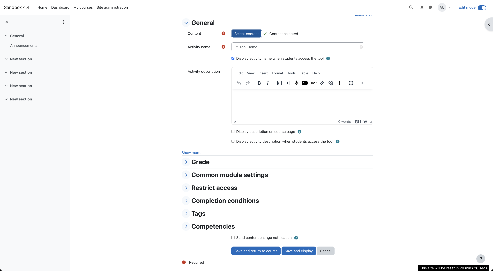

For subsequent tool launches, users will be redirected immediately to the selected resource screen, bypassing the deep linking process.

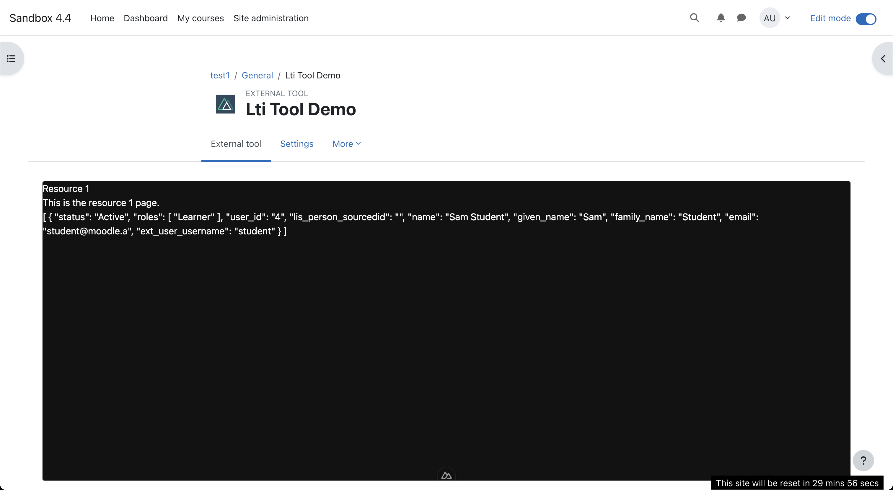

## Launch flow

Before describing the deep linking flow, let's first focus on the launch flow, as the deep linking flow contains almost identical launch flow.

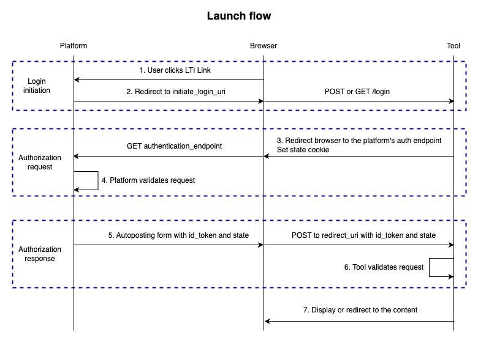

1. To initiate the launch flow, the user clicks on the LTI link. We have already seen this flow when we added a new LTI tool and clicked the “Save and Display” button. Subsequently, the launch flow can be initiated simply by going to the course and clicking on the LTI tool.

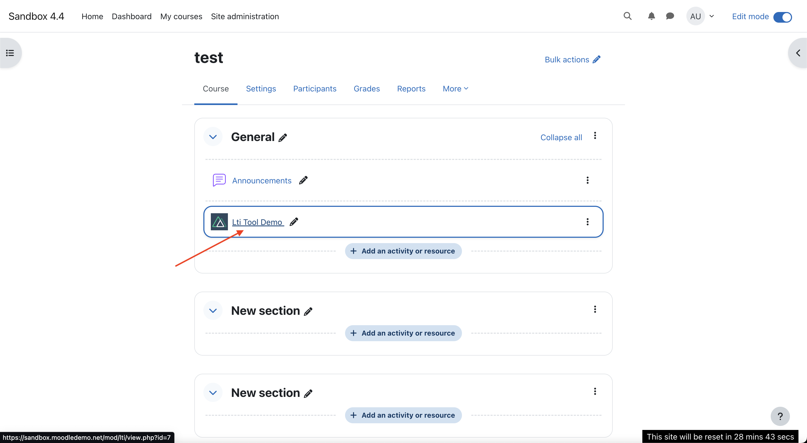

Clicking on LTI Tool Demo we are initiating launch flow

2. Upon launching the tool, the platform sends a `GET` or `POST` request to the tool’s login route. The platform knows the tool’s login route because it was specified during the registration process in the `registrationRequest['initiate_login_uri']`. In the case of Moodle, the `POST` method is used, and the body contains the following parameters:

```tsx
type LoginParams = {
  iss: string; // platform issuer
  target_link_uri: string; // URI of the target resource
  /**
   * login_hint value is opaque to the tool.
   * If present in the login initiation request,
   * the tool MUST include it back in the authentication request unaltered.
   */
  login_hint: string;
  /**
   * Similarly to the login_hint parameter
   * lti_message_hint value is opaque to the tool.
   * If present in the login initiation request,
   * the tool MUST include it back in the authentication request unaltered.
   */
  lti_message_hint: string;
  /**
   * The new optional parameter client_id specifies the client id
   * for the authorization server that should be used to authorize
   * the subsequent LTI message request.
   * This allows for a platform to support multiple registrations
   * from a single issuer
   */
  client_id: string;
  /**
   * The new optional parameter lti_deployment_id that if included,
   * MUST contain the same deployment id that would be passed in the
   * https://purl.imsglobal.org/spec/lti/claim/deployment_id claim for
   * the subsequent LTI message launch.
   */
  lti_deployment_id: string;
};
```

The tool also sets a state cookie to verify that the browser initiating the process is the same one completing it.

3. After setting the state cookie, the tool responds with a redirect to the platform's authentication endpoint, which was stored during the registration step. The `GET` request to the authentication endpoint contains the following query parameters:

```tsx
const authRequestQuery = {
  response_type: "id_token",
  response_mode: "form_post",
  id_token_signed_response_alg: "RS256",
  scope: "openid",
  client_id: params.client_id,
  redirect_uri: params.target_link_uri,
  login_hint: params.login_hint,
  nonce: randomNonce,
  prompt: "none",
  state: randomState,
  lti_message_hint: params.lti_message_hint,
  lti_deployment_id: params.lti_deployment_id,
};
```

The tool also sets a nonce in the authentication request, a random value used to ensure the launch is not replayed.

As described above, we return `login_hint` and `lti_message_hint` from the request that the platform sent to the tool.

The state is the same value set in the cookie.

4. The platform needs to validate the tool's request by ensuring that the `login_hint` matches the current session, the `redirect_uri` is among the allowed `redirect_uris` specified during the registration process, the scope is present and set to `openid`, etc.
5. After successful request verification, the platform responds with an auto-posting form containing `id_token` and `state`. An example`id_token` payload:

```tsx
{
  nonce: 'eclssma571if2blgqkovwtphg',
  iat: 1717565388,
  exp: 1717565448,
  iss: 'https://sandbox.moodledemo.net',
  aud: 'EZorFTLaBrEgszI',
  'https://purl.imsglobal.org/spec/lti/claim/deployment_id': '1',
  'https://purl.imsglobal.org/spec/lti/claim/target_link_uri': 'https://my-tool.com/launch',
  sub: '2',
  'https://purl.imsglobal.org/spec/lti/claim/lis': { person_sourcedid: '', course_section_sourcedid: '' },
  'https://purl.imsglobal.org/spec/lti/claim/roles':
   [ 'http://purl.imsglobal.org/vocab/lis/v2/institution/person#Administrator',
     'http://purl.imsglobal.org/vocab/lis/v2/membership#Instructor',
     'http://purl.imsglobal.org/vocab/lis/v2/system/person#Administrator' ],
  'https://purl.imsglobal.org/spec/lti/claim/context': { id: '5', label: 'test1', title: 'test', type: [ 'CourseSection' ] },
  'https://purl.imsglobal.org/spec/lti/claim/message_type': 'LtiResourceLinkRequest',
  'https://purl.imsglobal.org/spec/lti/claim/resource_link': { title: 'Lti Tool Demo', description: '', id: '1' },
  'https://purl.imsglobal.org/spec/lti-bo/claim/basicoutcome':
   { lis_result_sourcedid:
      '{"data":{"instanceid":"1","userid":"2","typeid":"1","launchid":498296097},"hash":"2dd97c56910b963a3cdbe2e12f7f5b1921e3162102292144935756cf781fab70"}',
     lis_outcome_service_url: 'https://sandbox.moodledemo.net/mod/lti/service.php' },
  given_name: 'Admin',
  family_name: 'User',
  name: 'Admin User',
  'https://purl.imsglobal.org/spec/lti/claim/ext': { user_username: 'admin', lms: 'moodle-2' },
  email: 'demo@moodle.a',
  'https://purl.imsglobal.org/spec/lti/claim/launch_presentation':
   { locale: 'en',
     document_target: 'iframe',
     return_url:
      'https://sandbox.moodledemo.net/mod/lti/return.php?course=5&launch_container=3&instanceid=1&sesskey=21mzlgrpDP' },
  'https://purl.imsglobal.org/spec/lti/claim/tool_platform':
   { product_family_code: 'moodle',
     version: '2024042200',
     guid: '1f60aaf6991f55818465e52f3d2879b7',
     name: 'Sandbox 4.4',
     description: 'Moodle 4.4 sandbox demo' },
  'https://purl.imsglobal.org/spec/lti/claim/version': '1.3.0',
  'https://purl.imsglobal.org/spec/lti/claim/custom':
   { resource_id: '1',
     context_memberships_url:
      'https://sandbox.moodledemo.net/mod/lti/services.php/CourseSection/5/bindings/1/memberships' },
  'https://purl.imsglobal.org/spec/lti-ags/claim/endpoint':
   { scope:
      [ 'https://purl.imsglobal.org/spec/lti-ags/scope/lineitem',
        'https://purl.imsglobal.org/spec/lti-ags/scope/lineitem.readonly',
        'https://purl.imsglobal.org/spec/lti-ags/scope/result.readonly',
        'https://purl.imsglobal.org/spec/lti-ags/scope/score' ],
     lineitems: 'https://sandbox.moodledemo.net/mod/lti/services.php/5/lineitems?type_id=1',
     lineitem:
      'https://sandbox.moodledemo.net/mod/lti/services.php/5/lineitems/5/lineitem?type_id=1' },
  'https://purl.imsglobal.org/spec/lti-nrps/claim/namesroleservice':
   { context_memberships_url:
      'https://sandbox.moodledemo.net/mod/lti/services.php/CourseSection/5/bindings/1/memberships',
     service_versions: [ '1.0', '2.0' ] }
}
```

Notice how the `https://purl.imsglobal.org/spec/lti/claim/message_type` claims is set to `LtiResourceLinkRequest`. Later on, for the deep linking request this claim will be set to `LtiDeepLinkingRequest`.

The browser then performs a `POST` request to the `/launch` route specified in the registration process as `target_link_uri`.

6. The tool needs to first verify the launch request. This includes validating the `id_token`, retrieving the state from the cookie and comparing it with the `state` from the request body, and ensuring the nonce has not already been used. For token validation, the tool will need to fetch the matching public key from the platform’s `jwks_uri` stored during the registration process.
7. Finally, the tool can redirect to the actual resource. It is advisable to use the same URL for every launch flow and store resource identifiers inside a custom claim in the `id_token`. As shown in the code, we stored `resource_id` inside the `https://purl.imsglobal.org/spec/lti/claim/custom` token claim.

## Deep linking flow

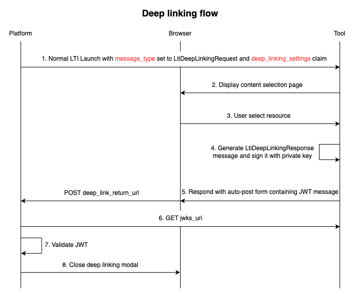

1. The deep linking launch flow is nearly identical to the normal launch flow, with the following exceptions: the `id_token` for deep linking has the `message_type` set to `LtiDeepLinkingRequest` and includes the `deep_linking_settings` claim. Additionally, the deep linking launch request is made to the `/deep-link-launch` route, as specified in the registration process for the `target_link_uri` for deep linking messages.

```tsx
// ...
'https://purl.imsglobal.org/spec/lti/claim/message_type': 'LtiDeepLinkingRequest',
'https://purl.imsglobal.org/spec/lti-dl/claim/deep_linking_settings': {
	accept_types: [ 'ltiResourceLink' ],
	accept_presentation_document_targets: [ 'frame', 'iframe', 'window' ],
	accept_copy_advice: false,
	accept_multiple: true,
	accept_unsigned: false,
	auto_create: false,
	can_confirm: false,
	deep_link_return_url:
  'https://sandbox.moodledemo.net/mod/lti/contentitem_return.php?course=5&id=1&sesskey=lFVWpuFgga',
  title: 'Nuxt LTI Tool',
  text: ''
}
```

2. After the deep linking launch is initiated, the tool redirects to or displays a content selection page where users can select a resource.
3. The user selects a resource to be used for future launches.
4. The tool generates a deep linking message response in the form of a JWT token. The JWT token is signed with the tool's private key for that platform.

```tsx
const jwtBody = {
  iss: clientId,
  aud: platformIssuer,
  nonce,
  "https://purl.imsglobal.org/spec/lti/claim/deployment_id": deploymentId,
  "https://purl.imsglobal.org/spec/lti/claim/message_type":
    "LtiDeepLinkingResponse",
  "https://purl.imsglobal.org/spec/lti/claim/version": "1.3.0",
  "https://purl.imsglobal.org/spec/lti-dl/claim/content_items": [
    {
      type: "ltiResourceLink",
      title: "Lti Tool Demo",
      custom: {
        resource_id: resourceId,
      },
      lineItem: {
        scoreMaximum: 100,
        resourceId,
      },
    },
  ],
};
```

5. The tool responds with an auto-posting form containing the previously generated JWT.

The response looks like this:

```tsx
return `<form id="ltijs_submit" style="display: none;" action="${returnUrl}" method="POST">
    <input type="hidden" name="JWT" value="${message}" />
  </form>
  <script>
    document.getElementById("ltijs_submit").submit()
  </script>`;
```

6. When the platform receives a `POST` request containing the tool’s JWT, it must verify the token by fetching the tool's public keys with a `GET` request to the tool’s `jwks_uri`. The `jwks_uri` was specified during the registration process, so the platform knows where to retrieve the public keys.
7. The platform validates the JWT token.
8. After successful validation, the deep linking process is completed and the modal is closed.

At this point, we should have a better understanding of the deep linking and launch flows. These processes allow the platform to select which tool resource to display and then display it when an LTI launch is triggered.

The only remaining topics are: Names and Role Provisioning Services, and Assignment and Grading Services. But before that, let’s explain how to retrieve an access token from the platform, which will be used to communicate with these services.

## Access token request

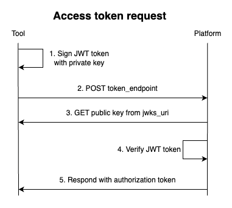

1. The tool signs the JWT using a private key. The `sub` and `iss` fields should be set to the `clientId`, and the `aud` should be set to the `token_endpoint`.

```tsx
const token = jwt.sign(
  {
    sub: platform.clientId,
    iss: platform.clientId,
    aud: platform.accesstokenEndpoint,
    jti: randomJti, // Random value
  },
  platformPrivateKey,
  {
    algorithm: "RS256",
    expiresIn: "1h",
    keyid: platform.kid,
  }
);
```

2. The tool sends a POST request to the platform’s `token_endpoint` that was specified during the registration process. The request body should include the following:

```tsx
  const body = {
    grant_type: "client_credentials",
    client_assertion_type: "urn:ietf:params:oauth:client-assertion-type:jwt-bearer",
    client_assertion: token,
    scope: scopes.join(" ")),
  };
```

where the `token` is signed JWT from the previous step.

The scope for which the access token is issued should be minimal, covering only the services for which the token will be used. For instance, a token with the scope [`https://purl.imsglobal.org/spec/lti-nrps/scope/contextmembership.readonly`](https://purl.imsglobal.org/spec/lti-nrps/scope/contextmembership.readonly) should only be used for making requests to the Names and Role Provisioning Service, which handles course participant information.

3. Upon receiving the request, the platform retrieves the tool’s public key by sending a `GET` request to the tool’s `jwks_uri`, as specified in the registration process.
4. The platform then verifies the token.
5. After successful verification, the platform issues an authorization token, which will then be used to access the requested services.

## Names and Role Provisioning Service

A very common use for this service is to provide a roster (a list of enrollments) for a course.

In this example, we will demonstrate how to fetch course participants and display them within the tool application.

If you haven’t done so already, create a new course and enroll some students as [described previously](https://www.notion.so/Creating-LTI-compatible-Tool-3563bbb039874eb1b9a1892e7baba4bb?pvs=21). Then, add our LTI Nuxt Tool to the course and select `Resource 1` during the deep linking process.

The `Resource 1` page should display the course roster.

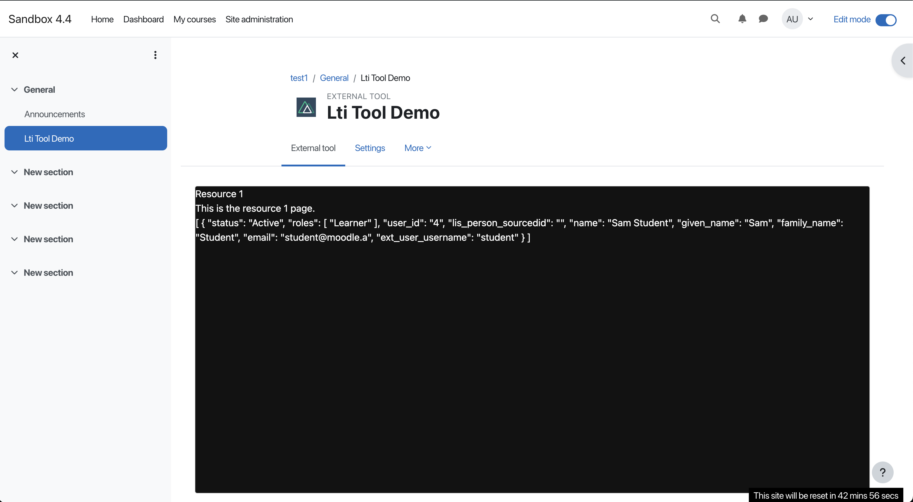

If you look at the `membership` route in the source code, you will see that it primarily involves creating an access token and sending a request to the membership URL obtained from the `id_token`, in addition to token validation and retrieving data from internal storage.

```tsx
const { accessToken, tokenType } = await getAccessToken(platform, [
  "https://purl.imsglobal.org/spec/lti-nrps/scope/contextmembership.readonly",
]);

const { context_memberships_url: membershipUrl } =
  idToken["https://purl.imsglobal.org/spec/lti-nrps/claim/namesroleservice"];
return $fetch(membershipUrl, {
  headers: {
    Authorization: `${tokenType} ${accessToken}`,
    Accept: "application/vnd.ims.lti-nrps.v2.membershipcontainer+json",
  },
});
```

An example of a membership response looks like this:

```tsx
{
  "id": "https://sandbox.moodledemo.net/mod/lti/services.php/CourseSection/10/bindings/7/memberships",
  "context": {
	    "id": "10",
	    "label": "test7",
	    "title": "test"
  },
  "members": [
    {
        "status": "Active",
        "roles": [
            "Learner"
        ],
        "user_id": "4",
        "lis_person_sourcedid": "",
        "name": "Sam Student",
        "given_name": "Sam",
        "family_name": "Student",
        "email": "student@moodle.a",
        "ext_user_username": "student"
    },
  ]
}
```

## Assignment and Grading Services

An important aspect of LTI 1.3 is the tool's ability to send grades to the platform.

First, let's explore how the grade book functions. The grade book is a data structure on the platform that stores scores. It is organized as a table, with line items representing columns and users filling the rows. Each line item typically corresponds to a resource or activity in the tool, so the cell at the intersection of a user and a line item displays that user's result for the specified activity.

The result includes a score and, optionally, a comment. The score indicates the grade that the user achieved in the activity and reveals the current status of the activity, whether it is completed or still in progress.

As shown in the image below, the tool we added appears as a column and the student appears as a row. The cell at the intersection is used to display the result for that user and the specific tool activity.

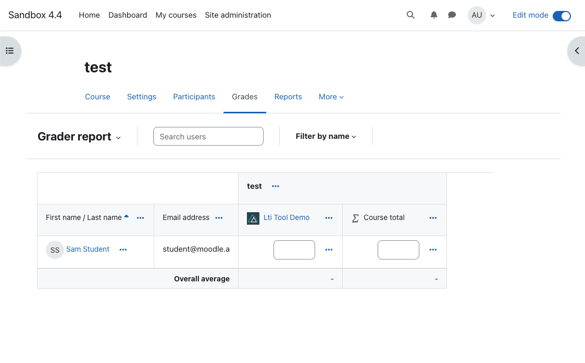

If we enroll another user and add our tool again, but this time select `Resource 2` during the deep linking process, we will see a new student row and a new tool column added to the grade book.


We can also name each line item added to the grade book differently, depending on the selected resource. Currently, this is hardcoded in the `deep-linking-resource.post` route file:

```tsx
const item = {
  type: "ltiResourceLink",
  title: "Lti Tool Demo",
  custom: {
    resource_id: resourceId,
  },
  lineItem: {
    scoreMaximum: 100,
    resourceId,
  },
};
```

Additionally, each tool doesn't need to create a line item if the resource or activity doesn't require posting scores back to the platform. For example, Resource 1 does not include any scoring logic. In contrast, Resource 2 includes a scoring option; when launched, Resource 2 displays a slider input allowing the user to choose a score and then post it.

When an admin adds Resource 2 to the course, it is important to log in as a student (the easier way is to open new private window), launch the tool, and submit a score to post it.

The image below shows the Resource 2 page with the slider for selecting and submitting a score.

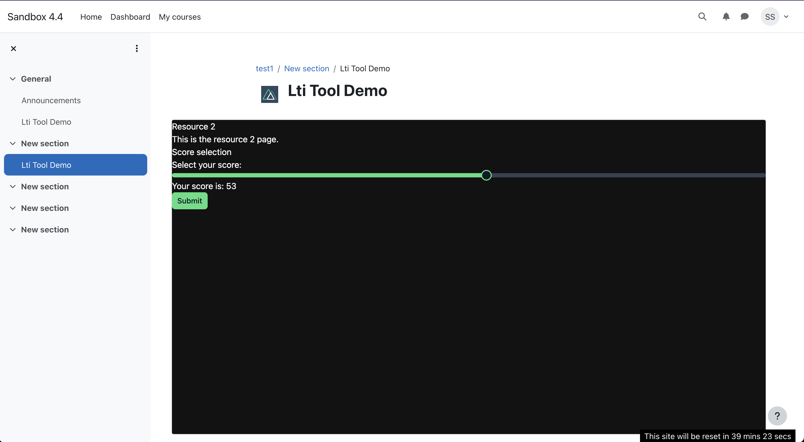

After submitting a score as a student user, navigate to the “Grades” tab, where you should see your score displayed.

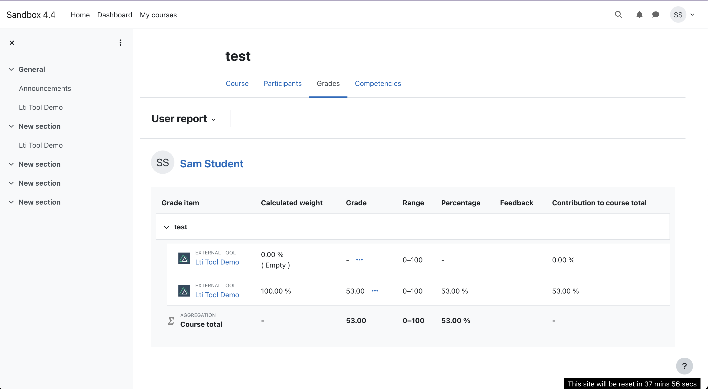

Additionally, if you refresh your admin Grades page, you should see that the score cell for that user and activity has also been updated.

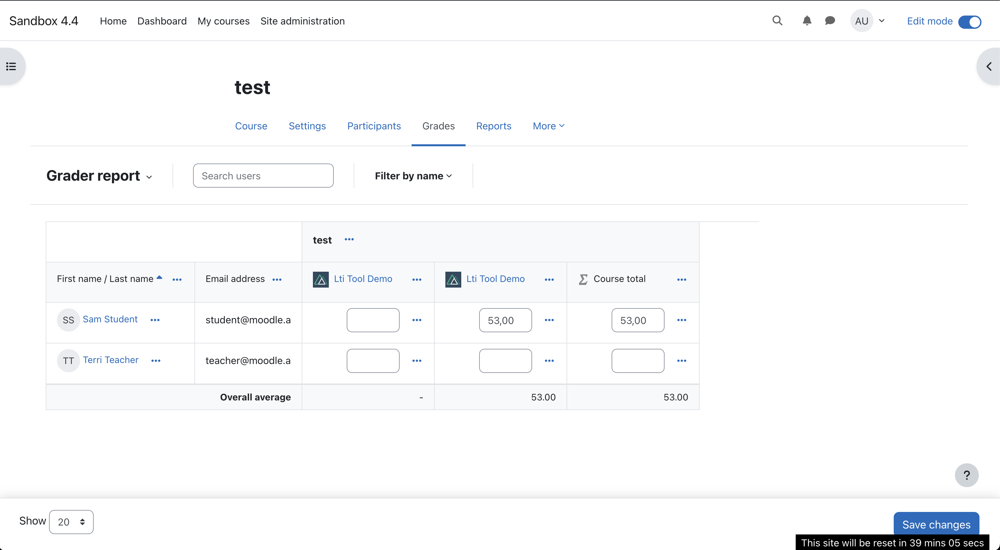

As mentioned above, not every tool resource or activity needs to add a line item to the grade book. Creating a line item can be done during the deep linking process, as demonstrated in this example, or during the score submission request by making a create request to the Scores and Grade service endpoint.

For example, if we want to create a line item for `Resource 2` during the deep linking process, as this resource is the only one that submits a score, we can make the following change:

```tsx
const item = {
  type: "ltiResourceLink",
  title: "Lti Tool Demo",
  custom: {
    resource_id: resourceId,
  },
  ...(resourceId === 2 && {
    lineItem: {
      scoreMaximum: 100,
      resourceId,
    },
  }),
};
```

This way, no line item will be created if we choose `Resource 1` during the deep linking process.

When the score is submitted on the tool’s frontend, it sends a request back to the server. We then need to retrieve a new access token with the correct scopes and send a request to update the score. As mentioned earlier, if the line item was not created during the deep linking process, we will need to create a new line item for that resource or activity before sending the request to update the score.

Here is the code example for updating the score when the line item is created during the deep linking process:

```tsx
const { accessToken, tokenType } = await getAccessToken(platform, [
  "https://purl.imsglobal.org/spec/lti-ags/scope/score",
]);

const payload = {
  timestamp: new Date(),
  scoreGiven: score,
  scoreMaximum: 100,
  activityProgress: "Completed",
  gradingProgress: "FullyGraded",
  userId,
};

const scoreUrl = new URL(
  idToken["https://purl.imsglobal.org/spec/lti-ags/claim/endpoint"].lineitem
);
scoreUrl.pathname = `${scoreUrl.pathname}/scores`;
await $fetch(scoreUrl.href, {
  method: "POST",
  headers: {
    Authorization: `${tokenType} ${accessToken}`,
    "Content-Type": "application/vnd.ims.lis.v1.score+json",
  },
  body: payload,
});
```

We retrieve the access token in the same way as we did previously for the membership request. After that, we construct the score payload and send a `POST` request to the line item score URL. To construct this URL, we append `/scores` to the line item path. If the line item is already created, that endpoint will be present in the ID token under the [`https://purl.imsglobal.org/spec/lti-ags/claim/endpoint`](https://purl.imsglobal.org/spec/lti-ags/claim/endpoint) claim.

The assignment and grading services offer additional options, such as retrieving results from the grade book, retrieving a line item, and creating a line item. However, these processes are not covered here, as they follow the same steps already described: retrieving an access token with the correct scope and sending it to the corresponding platform endpoint.
